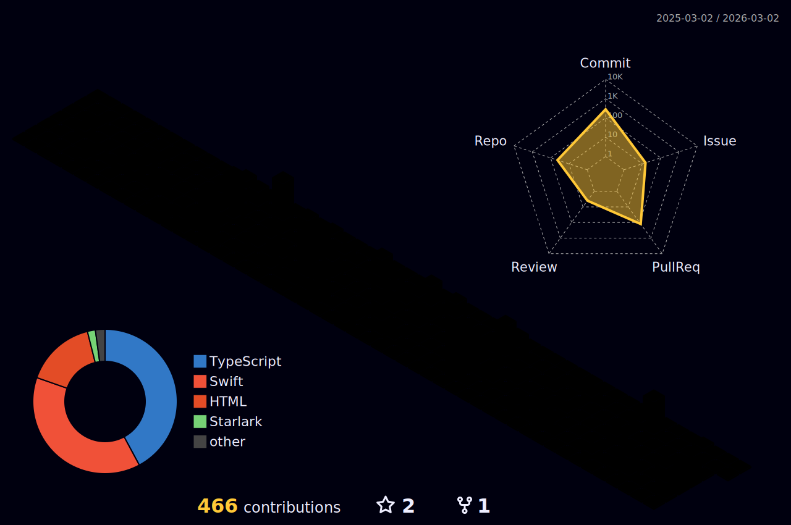

<h1 align="center">Hi there, I'm Matheus 👋</h1>

  <a href="https://www.linkedin.com/in/maatheusgois/">LinkedIn</a> •
  <a href="https://twitter.com/maatheusgois">Twitter</a> •
  <a href="https://gois.dev.br">Website</a>

---

💼 Working at <strong>DoorDash</strong> as a Software Engineer  
🧠 Passionate about distributed systems, backend infrastructure, and developer experience  
🎓 Former intern at iFood & Trybe

---

## 🧱 GitHub 3D Contribution Graph

  

---

## 📈 GitHub Stats

  
  

---

## 📫 Let's Connect

If you're working on something exciting or want to chat about backend systems or engineering growth, feel free to reach out!
